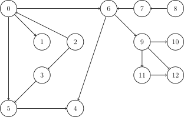

#### 拓扑排序（Topological sorting）要解决的问题是如何给一个`有向无环图(DAG)`的所有节点排序，代码的核心为维持一个`入度为 0` 的顶点的集合。
###### DAG：

##### 先`建邻接表`并`计算入度`：
```cpp
vector<int> ru(n);
vector<vector<int>> grid(n);
for (int i = 0; i < m; i++) {
	int u, v;
	cin >> u >> v;
	//u, v 关系一定为 u -> v
	grid[u].push_back(v), ru[v]++;
}
```
`ru[2]`=`ru[8]`= 0
`ru[0]`=`ru[1]`=`ru[3]`=`ru[7]`=`ru[9]`=`ru[10]`=`ru[11]`= 1
`ru[4]`=`ru[5]`=`ru[6]`=`ru[12]`= 2
##### 排序算法：
```cpp
	queue<int> q;
	for (int i = 0; i < n; i++){
		if(!ru[i])q.push(i);
	}
	int pos = 0;
    while (!q.empty()) {
		int k = q.front();
        q.pop();
        for (auto it : grid[k]) {
	        if (--ru[it] == 0)q.push(it);
        }
        ans[k] = ++pos;
    }
    for (int i = 0; i < n; i++)cout << ans[i] << " \n"[i + 1 == n];
```
`ans[i]` : 点`i`排在第几个位置，即分配给它的数值(示例从1开始)。